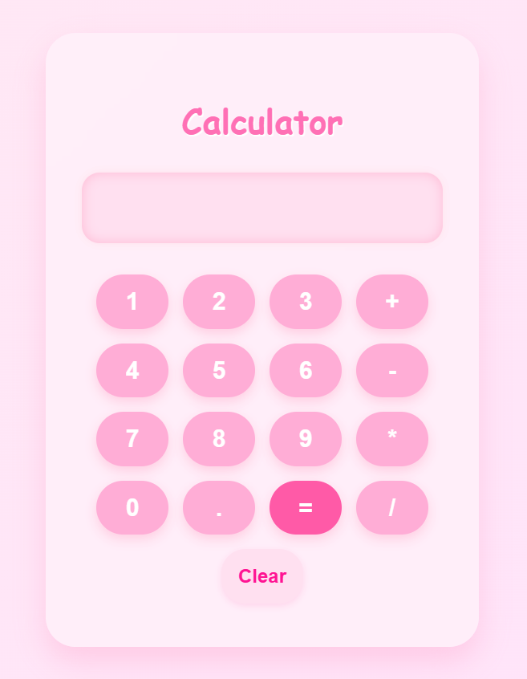

# 💖 Cute Bubble-Themed Calculator

A simple and adorable calculator built with HTML, CSS, and JavaScript. It supports basic operations (add, subtract, multiply, divide) with a pink bubbly UI.

## 🛠 Features
- Clean and responsive design
- Basic arithmetic operations
- Pink, soft, bubbly theme

## 🧪 Tech Stack
- HTML
- CSS
- JavaScript

## 🖼️ Screenshot



## 🌐 Live Demo

👉 [Click here to try it live](https://sh-a-gun.github.io/Calculator/)

## 📁 Project Structure

```bash
cute-calculator/
├── index.html         # Main HTML file
├── calculator.css          # CSS for styling
├── calculator.js          # JavaScript logic
├── sreenshot.png      # UI screenshot (note: spelling is 'sreenshot')
└── README.md          # Project documentation

